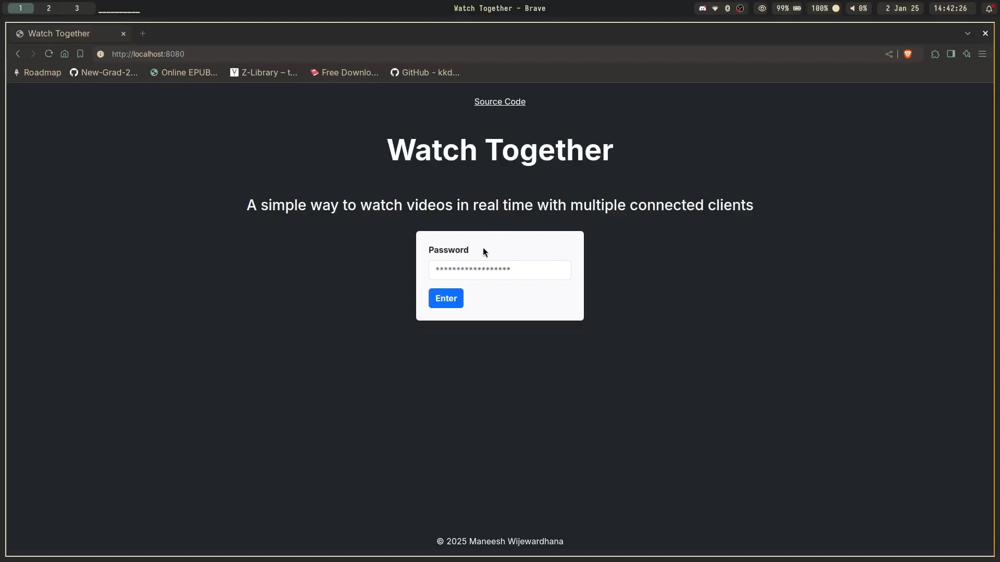

# Watch Together

- A simple way to watch videos in real time with multiple connected clients using websockets
- Implements real time play/pause and scrubbing and the ability to add/remove videos

# Demo

# Developing

### Server

- These env vars must be set before running the command below
    - export AWS_URL=
    - export AWS_ACCESS_KEY_ID=
    - export AWS_REGION=
    - export AWS_SECRET_ACCESS_KEY=
    - export AWS_S3_BUCKET=
    - export DATABASE_PUBLIC_URL=
    - export CLIENT_ID=
    - export CLIENT_SECRET=
    - export GOOGLE_REDIRECT_URL=
- `air` will run the server in watch mode, or simply run the server using `go run main.go`

### Client

- `npm install` to install tailwind
- `npx tailwindcss -i ./client/input.css -o ./client/output.css --minify --watch` to generate styles in watch mode
- `client.js` change websocket url to localhost when local server running

# TODO

- Bug when seeking, sends infinite play/pause messages
- Reconnect logic
- Use `slog` and clean up inconsistencies of fmt and log
- Chat system?
