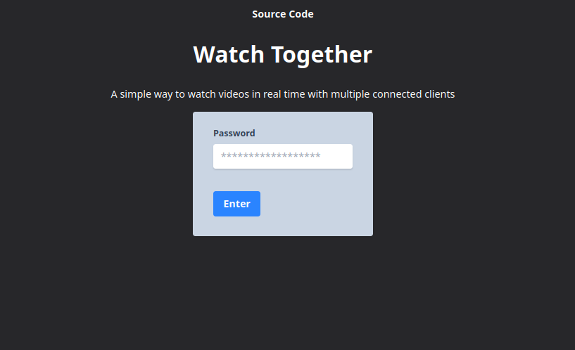
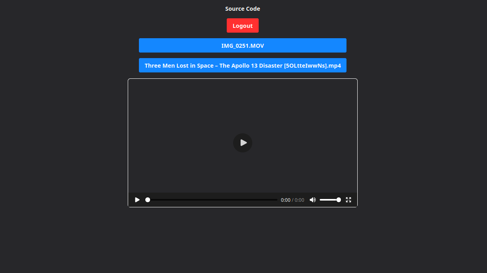
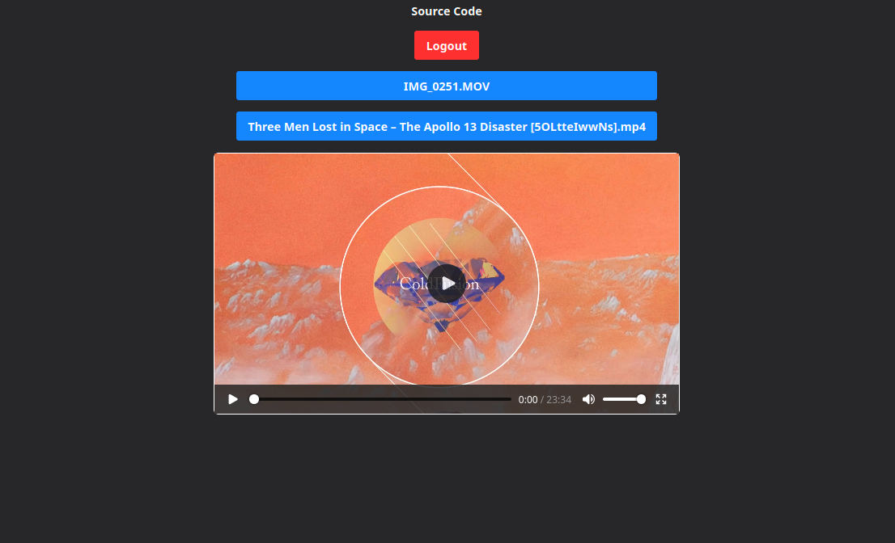

# Watch Together

- Allows a websocket connection (password protected) to stream videos to multiple clients with real time video controlling
- Lists videos from S3 bucket and allows user to choose one and have others connect to the same video "room"

# Screenshots

# Developing

### Server

- These env vars must be set before running the command below
    - export AWS_URL=
        - For accessing S3 bucket
    - export AWS_ACCESS_KEY_ID=
        - self-explanatory
    - export AWS_REGION=
        - Your S3 region
    - export AWS_SECRET_ACCESS_KEY=
        - self-explanatory
    - export AWS_S3_BUCKET=
        - For accessing bucket that contains video files
    - export PASSWORD=
        - Password to get into the video library
    - export COOKIE_VAL=
        - Cookie value you want to be set which the app will look for upon each request
- `go run main.go` will run the Go backend
- This project also uses [air](https://github.com/air-verse/air) for hot reloading

### Client

- To use localhost instead of prod url for Websocket creation, change url in `client.js`

### TODO

- [ ] Split video into chunks and send each chunk with an accurate progress bar
    - Or, try streaming video instead of full client download
- [ ] Add real time chat on the side and allow users to sign in via oAuth
    - Can use user info for chatting
    - Chat messages are persisted on different videos
- [ ] Figure out a way to add videos to s3 in a better way
    - Maybe create a separate service that fetches yt video, downloads it, and uploads to s3
